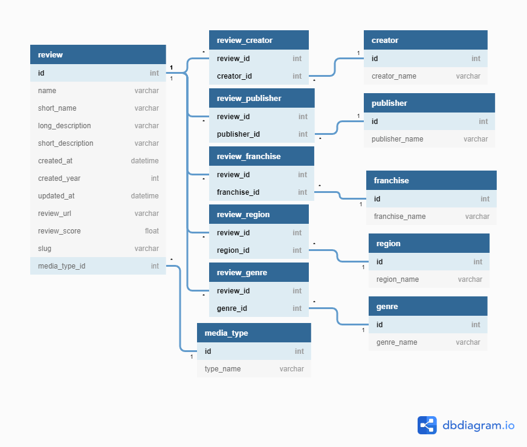

# Simple DB
a simple database used by API service. In this project, I will use SQLite as the database. 

## Database Selection
There are two main reason I choose SQL database instead of No-SQL database for this project:
- The given data is structured and comprehensive, which means that schema for the database will be relatively stable. The flexibility provided by No-SQL database may not benefit this project much.
- When using No-SQL database, typically we will store frequently accessed data together, and without normalization, the database will be larger than that of SQL database due to duplication. Also, considering Review record is relatively large, using SQL database can save a lot storage. 

## Database Structure 

The diagram is self-explanatory, so there is no more detail explaining the strcture, except following notes:
- review and media_type is one-to-many relationship
- review and creator, review and publisher, etc, are many-to-many relationship, therefore, requires auxiliary table to achieve it.
- in review table, id, name, created_at, created_year, updated_at, review_score, slug are non-nullable.
